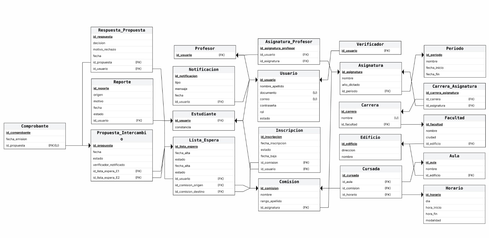

# Proyecto de Estudio!
    
**Estructura del documento principal:**

# PRESENTACIÓN (SISTEMA DE INTERCAMBIO DE COMISIONES (SIC-UNNE))

*Universidad*: Universidad Nacional del Nordeste  
*Facultad*: Facultad de Ciencias Exactas y Naturales y Agrimensura  
*Carrera*: Licenciatura en Sistemas de Información  
*Asignatura*: Base de Datos I  
*Año Lectivo*: 2025

**Integrantes**:
 - Riveros, Lautaro Ezquiel.
 - Riveros, Maximo Tomas.
 - Scetti, Santiago.
 - Turtola, Sabrina.


## CAPÍTULO I: INTRODUCCIÓN

### Caso de estudio

**Tema — Diseño y desarrollo de la base de datos para el Sistema de Intercambio de Comisiones (SIC-UNNE) con aplicación de roles, permisos y procedimientos almacenados.**
El sistema busca resolver la gestión manual e informal de los intercambios de comisiones en la UNNE mediante una base de datos que:

- Define roles de usuario (administrador, verificador y estudiante).
- Asegura la integridad académica (carreras, asignaturas, comisiones, horarios y docentes).
- Registra y audita acciones (intercambios, rechazos, reportes).
- Incorpora controles de seguridad (permisos, restricciones, triggers, SPs).

### Definición o planteamiento del problema

Actualmente, los intercambios se realizan de forma informal (redes sociales, WhatsApp), generando:

- Falta de trazabilidad: sin registros oficiales.
- Errores frecuentes: duplicaciones, intercambios múltiples inválidos.
- Ausencia de control institucional.
- Riesgo de manipulación o abuso.

El sistema propone un flujo seguro y auditable mediante:

- Administrador: registra carreras, materias, comisiones y abecedario de apellidos.
- Verificador: controla y recibe notificaciones de intercambios, reportes y consultas.
- Estudiante: se inscribe con validación de datos, gestiona comisiones, participa en lista de espera y acepta/rechaza propuestas.
- Mecanismo de match: el sistema propone intercambios cuando dos estudiantes son compatibles. Se notifican a ambas partes y al verificador.

Casos de rechazo:

- Rechazo individual → justificación, el otro alumno vuelve a la lista.
- Rechazo doble → quedan registros, ambos salen de la lista.
- Tres rechazos → el sistema reporta e inhabilita al estudiante.

### Preguntas Generales
- ¿Cómo diseñar una base de datos que gestione de manera segura, consistente y eficiente el intercambio de comisiones en la UNNE, diferenciando roles y garantizando transparencia?

### Preguntas Específicas

- ¿Cómo organizar los roles y permisos para que cada usuario acceda solo a la información que le corresponde?
- ¿Qué procedimientos almacenados deben implementarse para gestionar inscripciones, listas de espera e intercambios?
- ¿Cómo asegurar la integridad de datos en los procesos de intercambio de comisiones?
- ¿Qué mecanismos garantizan la trazabilidad y auditoría de los intercambios y rechazos?
- ¿Qué índices optimizan las búsquedas de alumnos, comisiones e intercambios?
- ¿Cómo garantizar la atomicidad de los intercambios mediante transacciones y triggers?

### Objetivos Generales

Diseñar e implementar la base de datos del SIC-UNNE aplicando seguridad, eficiencia y consistencia, con permisos, procedimientos, índices y transacciones que aseguren un sistema confiable y auditable.

### Objetivos Específicos

Permisos y roles

 - Definir privilegios de administrador, verificador y estudiante (principio de menor privilegio).
 - Validar accesos con casos de prueba.

Procedimientos y funciones almacenadas

- SPs para inscripciones, lista de espera, generación/aceptación/rechazo de intercambios, emisión de comprobantes.
- Funciones de apoyo para validar estados y consultas frecuentes.

Optimización de consultas

- Identificar tablas críticas (comisiones, inscripciones, propuestas, notificaciones).
- Implementar índices clustered, nonclustered y filtrados.
- Medir el impacto en el rendimiento.

Transacciones y triggers

- Garantizar atomicidad en intercambios y comprobantes.
- Usar transacciones anidadas en procesos complejos.
- Probar escenarios de error para asegurar consistencia.

### Descripción del Sistema

El SIC-UNNE es un sistema diseñado para digitalizar y automatizar el proceso de intercambio de comisiones en la Universidad Nacional del Nordeste.
Integra el registro de estudiantes, comisiones, horarios y docentes, ofreciendo un flujo seguro y auditable.

**Módulos principales:**

- **Gestión de usuarios y roles** (administrador, verificador, estudiante).
- **Administración académica:** carreras, asignaturas, comisiones y horarios.
- **Intercambio de comisiones:** listas de espera, generación de propuestas, aceptación/rechazo.
- **Notificaciones y reportes a estudiantes y verificadores.**
- **Seguridad y auditoría:** permisos, triggers y procedimientos almacenados.

### Alcance

El sistema abarca la gestión completa del **intercambio de comisiones**, incluyendo:

- **Registro de usuarios institucionales** (administradores, verificadores, estudiantes).
- **Alta y control** de carreras, asignaturas, comisiones y docentes.
- **Inscripción** de estudiantes y validación de pertenencia a comisiones.
- **Listas** de espera para solicitudes de intercambio.
- **Propuestas automáticas** de match entre estudiantes.
- **Registro y control** de rechazos con justificación y sanciones.
- **Generación de reportes y notificaciones**.

**No incluye:**

- Integración con **sistemas externos** de gestión académica.
- **Validación legal** de los intercambios.
- Funcionalidades avanzadas de **predicción o análisis académico**.

## CAPITULO II: MARCO CONCEPTUAL O REFERENCIAL
A continuación se desarrollan los conceptos teóricos correspondientes a los temas asignados al equipo, aplicados al proyecto SIC-UNNE (Sistema de Intercambio de Comisiones). Cada tema aborda técnicas y herramientas avanzadas del motor SQL Server que permiten asegurar la eficiencia, consistencia, seguridad y trazabilidad del sistema.

### TEMA 1 — Procedimientos y Funciones Almacenadas
Los procedimientos almacenados y las funciones constituyen herramientas fundamentales dentro del motor de base de datos para encapsular lógica de negocio, mejorar el rendimiento del sistema y garantizar operaciones seguras y consistentes.

#### **1. Introducción**

#### **2. Procedimientos Almacenados**

#### **3. Funciones Almacenadas**

#### **4. Aplicación en el SIC-UNNE**

### TEMA 2 — Optimización mediante Índices

#### **1. Introducción a la Optimización por Índices**

En los sistemas de gestión de bases de datos, la eficiencia de las consultas (SELECT) es un factor decisivo para el rendimiento general. A medida que las tablas crecen a miles o millones de registros, la búsqueda secuencial se vuelve extremadamente costosa. Los índices funcionan como atajos que permiten acceder rápidamente a las filas sin recorrer toda la tabla, cumpliendo un rol equivalente al índice de un libro.

#### **2. ¿Qué es un Table Scan?**

Un Table Scan ocurre cuando el motor lee fila por fila toda la tabla, evaluando cada registro para determinar si cumple una condición. Esto genera un gran consumo de CPU, memoria y tiempo.
Ejemplo:
```sql
SELECT *
FROM Lista_Espera
WHERE dni = '40111222';

````
Si dni no tiene índice, el motor debe recorrer todos los registros.

#### **3. ¿Qué problema ocurre en el SIC-UNNE?**

En el sistema, tablas como:
- Lista_Espera
- Inscripciones
- Estudiantes
- Comisiones
  
pueden alcanzar decenas de miles de registros durante los períodos de inscripción.
Consultas críticas como:
```sql
SELECT *
FROM Lista_Espera
WHERE legajo = 12345;

````
o
```sql
SELECT *
FROM Lista_Espera
WHERE estado = 'En espera';

````
provocan:
- lentitud
- bloqueos
- timeouts
- saturación del servidor

cuando no existen índices adecuados.

#### **4. Escenario sin Índices: La Pesadilla**

Supongamos una Lista_Espera con 20.000 estudiantes.
```sql
SELECT COUNT(*)
FROM Lista_Espera
WHERE estado = 'En espera'
  AND comision_id = 15;
````
Sin índices, el motor realiza:
```sql
20.000 comparaciones por consulta
× 1.000 estudiantes activos
= 20.000.000 comparaciones
````
Generando:
- API lenta
- exceso de carga
- congestión
- riesgo de caída

#### **5. Escenario con Índice: La Solución Óptima**
```sql
CREATE INDEX idx_lista_espera_estado_comision
ON Lista_Espera (estado, comision_id);
````
Beneficios:
- Acceso directo
- Búsqueda logarítmica
- Respuestas en milisegundos
- Reducción masiva de lecturas lógicas

#### **6. ¿Qué columnas conviene indexar en el SIC-UNNE?**
1. dni o legajo
```sql
CREATE INDEX idx_estudiantes_dni
ON Estudiantes (dni);
````
2. estado + comision_id
```sql
CREATE INDEX idx_lista_espera_estado_comision
ON Lista_Espera (estado, comision_id);
````
3. estudiante_id
```sql
CREATE INDEX idx_lista_espera_estudiante
ON Lista_Espera (estudiante_id);
````
4. materia_id + turno
```sql
CREATE INDEX idx_comisiones_materia_turno
ON Comisiones (materia_id, turno);
````

#### **7. Ventajas Tangibles**

- Consultas hasta 10× más veloces
- Menor carga del servidor
- Mayor estabilidad en momentos pico
- Reducción del I/O y CPU

#### **8. Desventajas de los índices**

- Requieren espacio
- Añaden costo en inserciones/updates
- Una mala selección genera fragmentación

Reglas:

- Indexar columnas muy consultadas
- No indexar columnas booleanas
- Mantener (reindexar) regularmente

#### **9. Conclusión**

Sin índices, el SIC-UNNE escala mal y sufre de Table Scans constantes.
Con índices adecuados, el sistema gana estabilidad, velocidad y capacidad para soportar miles de usuarios simultáneos.
La optimización de índices es indispensable para garantizar confiabilidad y rendimiento.

### TEMA 3 — Manejo de Transacciones

#### **1. Introducción**

En SQL Server, una transacción es una unidad de trabajo que agrupa varias operaciones para que se ejecuten de forma segura. Si todas las acciones son exitosas, los cambios se confirman; si ocurre un error, se revierten por completo.

Este mecanismo es fundamental en sistemas como el SIC-UNNE, donde procesos como inscripciones, movimientos a lista de espera o aceptación de propuestas no pueden quedar a medio completar. Las transacciones aseguran que los datos se mantengan coherentes incluso ante fallos, errores de usuario o problemas de concurrencia.

#### **2. Propiedades ACID**

Las transacciones se rigen por cuatro principios fundamentales:

**A — Atomicidad**

Todo se ejecuta o no se ejecuta.
Evita estados parciales, por ejemplo, cuando dos alumnos intercambian comisiones y solo uno de ellos llega a actualizarse.

**C — Consistencia**

Los datos pasan siempre de un estado válido a otro.
Las reglas del sistema (cupos, estados, relaciones) se respetan siempre.

**I — Aislamiento (Isolation)**

Dos procesos simultáneos no deben interferir entre sí.
Ejemplo: evitar que dos estudiantes reserven el mismo último cupo al mismo tiempo.

**D — Durabilidad**

Una vez confirmado (COMMIT), el cambio es permanente incluso ante fallos del sistema.

#### **3. Comandos básicos**

Las transacciones se manejan con tres comandos principales:

**BEGIN TRANSACTION**

Inicia la transacción.
Todo lo que se ejecute después formará parte de la misma unidad de trabajo.

**COMMIT**

Confirma la transacción.
Los cambios quedan guardados de manera definitiva.

**ROLLBACK**

Revierte por completo la transacción.
Deshace todos los cambios realizados desde el BEGIN; se utiliza en caso de errores, validaciones fallidas o inconsistencias detectadas.

En el SIC-UNNE, ROLLBACK evita que una inscripción, propuesta o intercambio quede incompleto o con datos inválidos.

#### **4. Savepoints**

Los **SAVEPOINT** permiten crear puntos intermedios dentro de una transacción.
Si una parte falla, se puede revertir solo hasta ese punto, sin perder todo lo previamente realizado.
Ejemplo conceptual:
```sql
BEGIN TRAN
SAVE TRAN validaciones

-- Validaciones críticas
IF (@esCompatible = 0)
    ROLLBACK TRAN validaciones

-- Cambios finales
COMMIT
````
Esto es útil en procesos complejos donde algunas validaciones pueden fallar, pero no queremos descartar todo el progreso.

#### **5. Aplicación en el SIC-UNNE**

Las transacciones son esenciales para garantizar integridad y coherencia en los procesos académicos del sistema.
Ejemplos de uso:

✔ **Inscripción de estudiantes**

Evita que un alumno quede inscripto en dos comisiones o que se registre sin validar cupo.

✔ **Movimientos a lista de espera**

Agrupa validaciones, inserciones y actualizaciones en un solo bloque seguro.

✔ **Generación y aceptación de propuestas de intercambio**

Asegura que ambos estudiantes intercambien correctamente sus comisiones o que, ante un error, se vuelva todo al estado original.

✔ **Registro de rechazos**

Permite actualizar el estado de la propuesta, la justificación y el historial del estudiante como una operación indivisible.

✔ **Interacciones con triggers**

Si un trigger falla (como el que controla propuestas), la transacción completa se revierte automáticamente, protegiendo la integridad del sistema.

### TEMA 4 — Triggers (Disparadores)

Los **triggers** son objetos del motor SQL que se ejecutan automáticamente cuando ocurre un evento específico sobre una tabla, como una operación INSERT, UPDATE o DELETE. Su función principal es permitir la ejecución automática de reglas de negocio, validaciones o procesos de auditoría sin necesidad de intervención externa.

A diferencia de un procedimiento almacenado tradicional, un trigger no se invoca manualmente, sino que se activa como consecuencia directa de una modificación en los datos.

SQL Server provee dos tablas virtuales, inserted y deleted, que permiten comparar el estado anterior y el nuevo estado de un registro, facilitando tareas como auditoría, control de integridad y restricciones personalizadas sobre los cambios realizados en la base de datos.

#### **Tipos de triggers en SQL Server**

- **AFTER (o FOR) INSERT/UPDATE/DELETE:**
Se ejecutan después de que la operación DML ocurre. Son ideales para auditorías o actualizaciones automáticas.
- **INSTEAD OF INSERT/UPDATE/DELETE:**
Sustituyen la operación original. Se emplean para evitar eliminaciones físicas o validar la operación antes de permitirla.

Estos mecanismos permiten implementar reglas de negocio más complejas que no pueden lograrse mediante simples restricciones (CHECK, FOREIGN KEY, etc.).

#### **Usos comunes de los triggers**

- **Auditoría de cambios:** permiten registrar valores antes de un UPDATE o DELETE.
- **Validación de operaciones:** impiden actualizaciones no autorizadas.
- **Bloqueo de eliminaciones físicas:** obligan a usar estados en vez de borrar información.
- **Asegurar integridad lógica:** mantienen coherencia en procesos automáticos.
- **Sincronización entre tablas:** actualizan datos derivados sin intervención de la aplicación.

#### **Aplicación de triggers en el SIC-UNNE**

En el sistema SIC-UNNE, los triggers se emplean para reforzar la trazabilidad y la integridad del proceso de intercambio de comisiones. Su rol es clave en dos áreas:

1. **Auditoría de Inscripciones**

Se diseñaron triggers AFTER UPDATE y AFTER DELETE sobre la tabla Inscripcion para registrar:

- datos anteriores del registro,
- fecha y hora del evento,
- usuario de SQL Server,
- tipo de operación realizada.

De esta forma, cada modificación o baja queda trazada en la tabla Auditoria_Inscripcion, asegurando transparencia y un historial completo del estudiante.

#### 2. **Protección y control sobre Propuestas de Intercambio**
 
La tabla Propuesta representa el corazón del mecanismo de match entre estudiantes. Por ello se implementaron dos tipos de triggers:

- **INSTEAD OF DELETE:**
evita la eliminación física de una propuesta.
Esto garantiza integridad, ya que una propuesta no debe desaparecer:
su historial, estado y sus rechazos deben mantenerse.
- **AFTER UPDATE:**
restringe las actualizaciones permitidas.
Solo puede modificarse el estado de la propuesta;
cambios en las listas, fechas o estudiantes involucrados son bloqueados.

Con esto se protege el flujo del intercambio y se impide la manipulación indebida de información crítica.

#### **Conclusión**

Los triggers implementados en el SIC-UNNE permiten asegurar:

- trazabilidad completa de las inscripciones,
- integridad lógica del proceso de intercambio,
- protección contra eliminaciones o modificaciones indebidas,
- cumplimiento estricto de las reglas de negocio definidas.

En conjunto, los triggers fortalecen la seguridad, la consistencia y la fiabilidad del sistema, actuando como un mecanismo automático que mantiene el orden interno de los datos sin depender de la aplicación cliente.

## CAPÍTULO III: METODOLOGÍA SEGUIDA 

El desarrollo del proyecto **SIC-UNNE** se llevó adelante siguiendo una metodología de trabajo organizada en etapas, combinando instancias grupales de diseño con tareas individuales según el tema asignado por la cátedra.

### 1. Definición del caso de estudio

El grupo decidió trabajar sobre el sistema de intercambio de comisiones de la UNNE, basándose en los requerimientos relevados previamente en Ingeniería de Software. Esta elección permitió partir de un problema real y continuar un proyecto ya familiar para todos los integrantes.

### 2. Modelado conceptual

Luego de estudiar el caso de uso, el grupo realizó varias reuniones para identificar las entidades principales, sus atributos y las relaciones necesarias.
A través de herramientas como ERDPlus se construyó el Diagrama Entidad–Relación (DER) general del sistema, refinándolo mediante consenso grupal.

### 3. Diseño lógico de la base de datos

Con el modelo conceptual definido, se elaboró un modelo relacional completo, definiendo:

- tablas, claves primarias y foráneas
- tipos de datos
- reglas de integridad (CHECK, UNIQUE, NOT NULL)
- estructura general del esquema

Esta etapa permitió preparar la base para la implementación de los temas avanzados de SQL.

### 4. Desarrollo individual según temas asignados

Cada integrante investigó y desarrolló su tema particular requerido por la cátedra:

- Procedimientos y funciones
- Índices y optimización de consultas
- Manejo de transacciones
- Triggers

Cada tema incluyó:
un archivo .sql, un .md explicativo y casos de prueba para validar los resultados.

### 5. Recursos Tecnológicos

- ERDPlus para modelado conceptual
- SQL Server Management Studio para implementación
- GitHub para documentación y control de versiones
- Markdown como formato base del informe

### 6. Validación y pruebas

El grupo realizó pruebas de funcionamiento ejecutando los scripts de creación, carga y los temas individuales. Se verificó:

- coherencia del modelo
- correcto funcionamiento de índices, triggers y transacciones
- integridad general de la base
- resultados esperados en cada caso de prueba

### 7. Puesta en común y cierre

Finalmente, cada miembro expuso su tema al resto del grupo.
Se revisó todo el repositorio, se ajustaron detalles y se preparó el documento final conforme a la estructura solicitada por la cátedra.

## CAPÍTULO IV: DESARROLLO DEL TEMA / PRESENTACIÓN DE RESULTADOS 

En este capítulo se exponen los datos y la información recolectada y organizada para el diseño del **SIC-UNNE (Sistema de Intercambio de Comisiones)**. El propósito central de este sistema es brindar una solución que permita ordenar y optimizar el proceso de intercambio de comisiones dentro de la Universidad Nacional del Nordeste, garantizando una gestión más ágil y confiable.

Para su desarrollo se recurrió a distintas herramientas y metodologías de modelado de datos. Entre ellas, destacan los **Diagramas Entidad–Relación (DER)**, que facilitan la representación visual de las entidades, sus atributos y los vínculos que las relacionan. Esta herramienta resultó clave para identificar la estructura general de la base de datos, su comportamiento y las restricciones necesarias para preservar la integridad de la información.

### Diagrama relacional
El **Modelo Relacional**, expresado a través del Diagrama Entidad–Relación (ER), constituye una representación conceptual de la base de datos que describe su organización lógica. En él se detallan las entidades principales, sus características más relevantes y las conexiones que mantienen entre sí.

En las páginas siguientes se presenta el Modelo Relacional del sistema **SIC-UNNE**, el cual muestra de manera gráfica las entidades definidas y sus relaciones en el contexto de la gestión académica y los procesos de intercambio de comisiones.



Desarrollo TEMA 1 "Procedimientos y funciones almacenadas"

> Acceder a la siguiente carpeta para la descripción completa del tema [scripts-> Tema01_procedimientos_funciones_almacenadas](../scripts/03_temas_investigacion/procedimientos_funciones/sp_funciones.md)

Desarrollo TEMA 2 "Optimización de consultas a través de índices"

> Acceder a la siguiente carpeta para la descripción completa del tema [scripts-> tema02_optimización_de_consultas_a_través_de_índices](../scripts/03_temas_investigacion/indices_optimizacion/optimizacion_indices_SIC.md)

Desarrollo TEMA 3 "Manejo de Transacciones"

> Acceder a la siguiente carpeta para la descripción completa del tema [scripts-> tema03_transacciones](../scripts/03_temas_investigacion/manejo_transacciones/manejo_transacciones.md)

Desarrollo TEMA 4 "Triggers (Disparadores)"

> Acceder a la siguiente carpeta para la descripción completa del tema [scripts-> tema04_triggers](../scripts/03_temas_investigacion/Triggers/Triggers.md)


## CAPÍTULO V: CONCLUSIONES

El desarrollo del proyecto **SIC-UNNE** permitió comprender, diseñar e implementar una base de datos completa aplicada a un caso real dentro del ámbito académico. El trabajo integró múltiples conceptos avanzados de SQL Server —procedimientos, funciones, índices, transacciones y triggers— demostrando cómo cada uno de ellos aporta un valor fundamental a la arquitectura final del sistema.

A lo largo del proyecto, se observó que **no existe un único componente que garantice la calidad del sistema**, sino que es la combinación coordinada de todos ellos lo que permite alcanzar un modelo de datos seguro, eficiente y coherente con las necesidades institucionales.

En primer lugar, el proceso de diseño conceptual y lógico permitió identificar con claridad las entidades y relaciones centrales del sistema de intercambio de comisiones. Esto sentó las bases para una estructura sólida, escalable y alineada con las reglas de negocio, facilitando su posterior implementación en SQL Server.

En cuanto a los módulos avanzados, se concluye lo siguiente:
- **Procedimientos y funciones almacenadas**
Estos componentes demostraron ser esenciales para encapsular la lógica de negocio del sistema. Los procedimientos permiten automatizar operaciones complejas (como inscripciones, movimientos en listas de espera o gestión de propuestas), mientras que las funciones aportan cálculos y validaciones reutilizables, reduciendo errores y manteniendo consistencia en las operaciones realizadas por estudiantes, verificadores o administradores.
- **Índices e impacto en el rendimiento**
El análisis del rendimiento mostró que la eficiencia del sistema depende directamente de un uso inteligente de índices. Tablas sensibles como Inscripciones, Comisiones, Lista_Espera y Propuesta requieren optimización debido a la gran cantidad de consultas que reciben en períodos de inscripción. La correcta implementación de índices agrupados y no agrupados —especialmente aquellos basados en columnas de búsqueda frecuente— redujo drásticamente el número de lecturas lógicas, evitando Table Scans y garantizando tiempos de respuesta óptimos incluso bajo carga alta.
- **Transacciones como garantes de integridad**
Las transacciones demostraron ser fundamentales para mantener la coherencia del sistema, sobre todo en procesos críticos como el intercambio entre estudiantes o la modificación de estados. A través de BEGIN TRAN, COMMIT y ROLLBACK, se aseguró que las operaciones ocurran bajo el principio de “todo o nada”, evitando estados intermedios que puedan comprometer la información académica. Asimismo, se reconoció la importancia de los SAVEPOINT para lograr una recuperación más granular en escenarios complejos.
- **Triggers como mecanismo de seguridad y trazabilidad**
Los triggers aportaron una capa adicional de control que no se puede obtener únicamente desde la aplicación cliente. Los triggers de auditoría permiten registrar de manera automática cualquier cambio en las inscripciones, generando un historial confiable que favorece la transparencia y facilita procesos de control institucional. Por su parte, los triggers sobre la tabla Propuesta impiden la eliminación física y limitan las actualizaciones sensibles, evitando manipulaciones indebidas y preservando la integridad del flujo de intercambio.

En conjunto, estos elementos conforman un sistema robusto que responde adecuadamente a las necesidades del contexto académico, garantizando **seguridad, velocidad, integridad y trazabilidad.** El trabajo realizado demuestra que el diseño de una base de datos no termina en su estructura, sino que requiere la incorporación estratégica de mecanismos avanzados que maximizan su capacidad y confiabilidad.

Finalmente, el proyecto permitió no solo aplicar los contenidos teóricos de la materia, sino también desarrollar habilidades colaborativas, de análisis y de diseño, fundamentales para el desarrollo profesional dentro del campo de los sistemas de información.

## BIBLIOGRAFÍA DE CONSULTA

Connolly, T., & Begg, C. (2015). Database Systems: A Practical Approach to Design, Implementation and Management (6ª ed.). Pearson.

Elmasri, R., & Navathe, S. (2016). Fundamentals of Database Systems (7ª ed.). Pearson.

Silberschatz, A., Korth, H. F., & Sudarshan, S. (2010). Database System Concepts (6ª ed.). McGraw-Hill.

Date, C. J. (2004). Introducción a los Sistemas de Bases de Datos. Addison-Wesley.

Ramakrishnan, R., & Gehrke, J. (2003). Database Management Systems. McGraw-Hill.

Coronel, C., Morris, S., & Rob, P. (2013). Database Systems: Design, Implementation, and Management. Cengage Learning.

García-Molina, H., Ullman, J., & Widom, J. (2009). Database Systems: The Complete Book. Prentice Hall.

### Documentación Oficial — SQL Server (Microsoft Learn)

Microsoft. CREATE TRIGGER (Transact-SQL).
https://learn.microsoft.com/en-us/sql/t-sql/statements/create-trigger-transact-sql

Microsoft. CREATE PROCEDURE (Transact-SQL).
https://learn.microsoft.com/en-us/sql/t-sql/statements/create-procedure-transact-sql

Microsoft. CREATE FUNCTION (Transact-SQL).
https://learn.microsoft.com/en-us/sql/t-sql/statements/create-function-transact-sql

Microsoft. Índices agrupados y no agrupados (SQL Server).
https://learn.microsoft.com/es-es/sql/relational-databases/indexes

Microsoft. Control de transacciones: BEGIN, COMMIT y ROLLBACK.
https://learn.microsoft.com/es-es/sql/t-sql/language-elements/transactions-transact-sql

Microsoft. Tablas inserted y deleted en triggers.
https://learn.microsoft.com/en-us/sql/t-sql/data-types/tables

Microsoft. Guía de optimización de consultas.
https://learn.microsoft.com/en-us/sql/relational-databases/query-processing-architecture-guide
